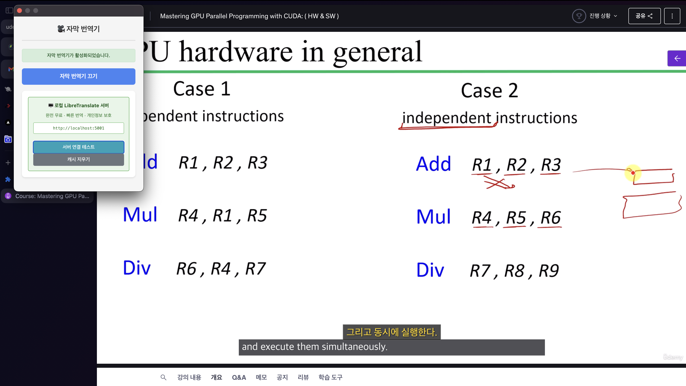

# 🎥 실시간 자막 번역기

영어 자막을 실시간으로 한국어로 번역하여 표시하는 Chrome 확장 프로그램입니다.
**로컬 LibreTranslate 서버**를 사용하여 **완전 무료**로 번역을 제공합니다.

## ✨ 주요 기능

- **실시간 자막 감지**: 웹페이지의 자막을 자동으로 감지하여 번역
- **로컬 번역 서버**: LibreTranslate 로컬 서버로 빠르고 안전한 번역
- **완전 무료**: 사용량 제한 없는 무료 번역 서비스
- **다중 플랫폼 지원**: YouTube, Netflix, Vimeo, Udemy 등 주요 동영상 플랫폼 지원
- **개인정보 보호**: 로컬 서버 사용으로 데이터 외부 전송 없음

## 📸 작동 화면

### 번역 전후 비교


_좌측: 확장 프로그램 설정 팝업 / 우측: 실시간 자막 번역 (원문 아래 금색 한국어 번역)_

### 주요 특징

- 🎯 **정확한 위치**: 원문 자막 바로 위에 번역문 표시
- 🔄 **실시간 동기화**: 자막 변경 시 즉시 번역 업데이트

## 🚀 설치 및 설정

### 1. LibreTranslate 로컬 서버 구축

먼저 Docker를 사용하여 LibreTranslate 서버를 로컬에 설치합니다:

```bash
# Docker 설치 (Mac)
brew install docker

# LibreTranslate 서버 실행 (영어-한국어 모델만)
docker run -d --name libretranslate -p 5001:5000 libretranslate/libretranslate --load-only en,ko

# 서버 상태 확인
curl http://localhost:5001/translate \
  -H "Content-Type: application/json" \
  -d '{"q":"Hello","source":"en","target":"ko"}'
```

### 2. Chrome 확장 프로그램 설치

1. Chrome 브라우저에서 `chrome://extensions/` 페이지를 엽니다
2. 우측 상단의 "개발자 모드"를 활성화합니다
3. "압축해제된 확장 프로그램을 로드합니다" 버튼을 클릭합니다
4. 이 프로젝트 폴더를 선택합니다

### 3. 권한 승인

확장 프로그램이 로드되면 다음 권한이 필요합니다:

- **스토리지**: 사용자 설정 저장
- **활성 탭**: 현재 탭에서 자막 감지
- **localhost 접근**: 로컬 LibreTranslate 서버 통신

## 🛠️ 사용 방법

### 🚀 간단한 3단계 사용법

1. **🐳 서버 확인**: LibreTranslate 서버 실행 상태 확인

   ```bash
   docker ps | grep libretranslate
   ```

2. **🌐 사이트 접속**: 동영상 사이트에 접속 (YouTube, Netflix, Udemy 등)

3. **⚡ 번역기 켜기**: 확장 프로그램 아이콘 클릭 → "자막 번역기 켜기"

### ✨ 자동 번역 과정

1. 영어 자막이 화면에 나타남
2. 자막 위쪽에 **금색 한국어 번역**이 자동 표시
3. 자막 변경 시 번역도 실시간 업데이트
4. 번역기 끄면 모든 번역 요소 자동 제거

### ⚙️ 최적화된 설정 (자동 적용)

- **🎯 번역 언어**: 영어 → 한국어 고정
- **🎨 자막 스타일**:
  - 번역문: 24px 금색 (#FFD700) - 가독성 최고
  - 원문: 기본 흰색 유지
  - 배경: 검은색 반투명
- **🖥️ 서버**: localhost:5001 자동 연결
- **🎛️ 간편 제어**: 켜기/끄기, 서버 테스트, 캐시 정리만 제공

## 🎯 지원 플랫폼

### 완전 지원

- **YouTube**: 모든 자막 형식 지원
- **Netflix**: 플랫폼 자막 지원
- **Vimeo**: 비디오 자막 지원
- **Udemy**: 강의 자막 지원

### 부분 지원

- **Coursera**: 강의 자막
- **edX**: 강의 자막
- **기타 HTML5 비디오**: 표준 자막 태그

## 🔧 LibreTranslate 서버 관리

### 서버 시작/중지

```bash
# 서버 시작
docker start libretranslate

# 서버 중지
docker stop libretranslate

# 서버 재시작
docker restart libretranslate

# 서버 로그 확인
docker logs libretranslate
```

### 추가 언어 모델 설치

```bash
# 더 많은 언어 지원 (서버 재생성 필요)
docker rm libretranslate
docker run -d --name libretranslate -p 5001:5000 \
  libretranslate/libretranslate --load-only en,ko,ja,zh,es,fr,de
```

## 🔍 문제 해결

### 번역이 되지 않는 경우

1. **LibreTranslate 서버 확인**:

   ```bash
   curl http://localhost:5001/languages
   ```

2. **Docker 컨테이너 상태 확인**:

   ```bash
   docker ps | grep libretranslate
   ```

3. **포트 충돌 확인**:
   ```bash
   lsof -i :5001
   ```

### 성능 최적화

1. **메모리 할당 증가**:

   ```bash
   docker run -d --name libretranslate -p 5001:5000 -m 4g \
     libretranslate/libretranslate --load-only en,ko
   ```

2. **캐시 정리**: 확장 프로그램 설정에서 "캐시 지우기" 실행

## 📁 프로젝트 구조

```
translation/
├── manifest.json          # 확장 프로그램 설정
├── content.js            # 자막 감지 및 번역 삽입
├── background.js         # LibreTranslate API 처리
├── popup.html           # 설정 UI
├── popup.js             # 설정 로직
├── styles.css           # 자막 스타일
├── images/              # 스크린샷 및 데모 이미지
└── README.md            # 프로젝트 설명
```

## 🔒 개인정보 보호

- ✅ **완전 로컬**: 모든 번역이 로컬 서버에서 처리
- ✅ **데이터 외부 전송 없음**: 번역 텍스트가 인터넷으로 전송되지 않음
- ✅ **로컬 저장**: 사용자 설정은 브라우저에만 저장
- ✅ **개인정보 수집 없음**: 브라우징 기록이나 개인 정보 수집하지 않음

## 💡 장점

### 기존 온라인 번역 API 대비

- **비용 없음**: Google Translate API(월 $20), DeepL API(월 $6.99) → **무료**
- **속도 빠름**: 네트워크 지연 없이 로컬에서 즉시 처리
- **사용량 제한 없음**: API 호출 횟수 제한 없음
- **개인정보 안전**: 번역 내용이 외부로 전송되지 않음
- **오프라인 가능**: 인터넷 연결 없이도 번역 가능

## 🚨 주의사항

- Docker Desktop이 실행 중이어야 합니다
- 초기 설치 시 언어 모델 다운로드로 시간이 걸릴 수 있습니다
- 일부 스트리밍 서비스에서는 DRM으로 인해 작동하지 않을 수 있습니다
- 번역 품질은 LibreTranslate 모델 성능에 따라 달라집니다

---

**완전 무료로 즐거운 학습되세요! 🎓✨**
